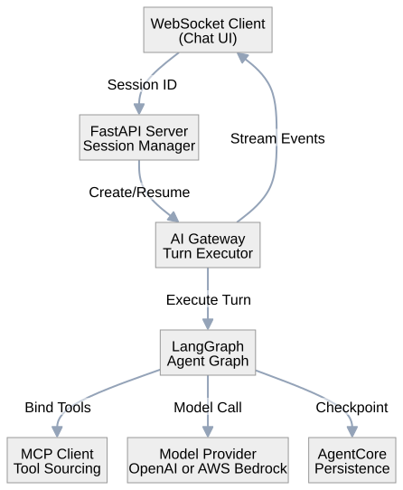
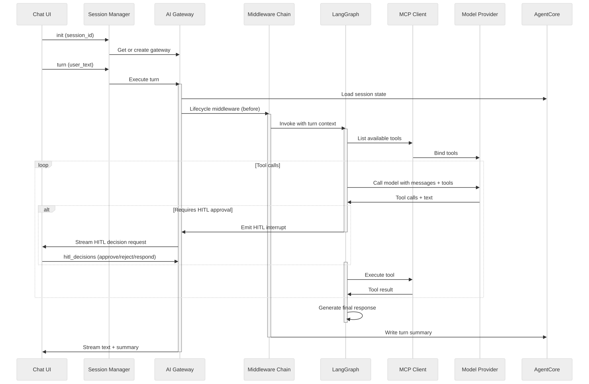
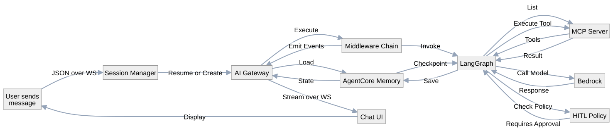

# AI Agent Architecture

A production-shaped LangGraph AI agent with middleware execution engine, human-in-the-loop with stateless resume, and a Bedrock-first (OpenAI also supported) model provider.

## System Overview



## Turn Execution Flow



## Component Architecture

### FastAPI Server & Session Management

- **Entry point**: `main.py` - FastAPI app with WebSocket and HTTP routes
- **Session layer**: `session.py` - LRU session cache with client-owned resume
  - Sessions are never destroyed by server disconnect
  - Client stores session_id and sends it back to resume
  - Enables stateless interrupt (HITL decision) + restart resilience

### AI Gateway

- **File**: `agent/ai_gateway.py`
- **Responsibility**: Own one turn from start to finish
  - Load session state from memory
  - Run through middleware chain
  - Invoke the LangGraph agent
  - Stream events back to client
  - Handle HITL interrupts (pause, wait for decision, resume)
- **Key property**: Gateway is ephemeral per turn, but state is persistent

### LangGraph Agent (Graph Builder)

- **File**: `agent/graph_builder.py`
- **Structure**:
  ```
  START -> Entry -> Agent --tool calls--> Tools (HITL gate) -> Context edits -> Agent -> Finalize
  ```
- **Key features**:
  - Tools are bound on every model call (no static graph)
  - System prompt is a static local placeholder (`agent/system_prompt.py`) —
    the companion `mcp-server-template` registers tools only, no MCP prompts
  - Supports tool parallel calling
  - HITL interrupts via `interrupt()` on specific tool calls

### Middleware Chain

Each middleware is independent, testable, and composed in order:

1. **Lifecycle Middleware** (`middleware/lifecycle_middleware.py`)
   - Reads memory before agent call
   - Writes turn summary after
   - Handles degradation fallback for memory failures

2. **Dynamic Tools Middleware** (`middleware/dynamic_tools_middleware.py`)
   - Appends ephemeral per-turn context block (memory, documents, session data)
   - Rendered at model-call time, never written to message history
   - Keeps context fresh without message history bloat

3. **Prompt Cache Middleware** (`middleware/prompt_cache_middleware.py`)
   - Writes `cache_control` into model settings
   - Bedrock `cachePoint` semantics
   - Tracks cache hits/misses in observability

4. **Context Overflow Middleware** (`middleware/context_overflow_middleware.py`)
   - Reactive safety net: if model call exceeds context, trim and retry once
   - Prevents entire turn failure from context limits

5. **Input Guardrail** (`middleware/input_guardrail.py`)
   - Validates user text once per turn before execution
   - **Fail-open by design** - moderation never takes chat down
   - Logs moderation scores for monitoring

6. **HITL Policy & Risk Classifier** 
   - `middleware/hitl_policy.py` - Which tools need approval
   - `middleware/risk_classifier.py` - Classify tools by risk level
   - Naming convention: `get_*` = readonly, else = mutation
   - Policy is re-derived for demo domain (not hardcoded product workflow)

### Orchestration Tool (`run_orchestration`)

- **Files**: `agent/orchestration/orchestration_tool.py`, `sandbox.py`, `tool_bridge.py`
- **What it is**: a local, in-process RestrictedPython sandbox for calling
  this agent's OWN already-bound tools in a dependent chain/branch/reshape/
  loop — a script does in one round trip what would otherwise take one model
  round trip per step.
- **Gated by**: `AGENT_ORCHESTRATION_ENABLED` only — no external AWS resource.
- **Safety boundary**: `tool_bridge.py`'s policy only allows read-only
  (`get_*`) tools through the sandbox. Mutations are refused from inside a
  script — HITL cannot see calls made through the bridge, so allowing them
  would be a real approval bypass. Mutations still work as normal tool calls
  outside the sandbox, where HITL applies as usual.
- **Not the same as `run_python` below** — no pandas/numpy/plotly, no math.

### Code Execution Tool (`run_python`)

- **Files**: `analysis/code_exec_tool.py`, `code_execution_service.py`, `sandbox.py`
- **What it is**: a remote AgentCore Code Interpreter sandbox for data
  analysis, statistics, and Plotly charts. Has NO access to this agent's own
  tools at all — data must be fetched via normal tool calls first, then
  passed into the Python code as a literal.
- **Gated by**: `AGENTCORE_CODE_INTERPRETER_ID` presence — no separate
  enabled flag (same id-presence pattern as AgentCore memory/KB).
- **Lifecycle**: self-contained per call — start a sandbox, run the code,
  download any produced files, stop the sandbox. No cross-call reuse, so
  each call must be a complete analysis (fetch/build data, compute, save any
  chart) in one shot.
- **Output**: chart/data files are registered for download at
  `GET /api/agent/download/{file_id}` and returned to the model as
  ready-to-paste markdown image/link syntax.

### MCP Client Integration

- **File**: `agent/utils/tool_helpers.py` + `mcp/client.py`
- **Responsibilities**:
  - Connect to MCP server over HTTP (StreamableHTTP)
  - List tools once at startup
  - Convert MCP tools to LangChain `Tool` objects
  - Fetch base system prompt from MCP server
  - Handle tool errors properly (`ToolException` + `isError` flag)

### State & Context

- **State**: `agent/state.py` - LangGraph state with side-state channels
  - Messages list (conversation history)
  - Checkpoints (for resumable conversations)
  - Side channels for metadata (turn id, context, etc.)

- **Context**: `agent/context.py` - Per-turn request context
  - User identity
  - Session metadata
  - Tenant/organization context if applicable
  - Document attachments
  - HITL decisions from human

### Human-in-the-Loop (HITL)

**Decision vocabulary**:
- `approve` - Execute the tool as proposed
- `reject` - Skip the tool with optional reason
- `respond` - Human's text becomes the tool result (for ask_user tool)
- `edit` - Modify tool arguments before approval

**Stateless resume protocol**:
1. Agent generates tool calls
2. Gateway checks HITL policy, identifies tools needing approval
3. Gateway interrupts: `interrupt()` on the tool node
4. Gateway emits `HitlEvent` to client with proposed actions
5. Client displays approval UI
6. User makes decision via `hitl_decisions` message
7. **Separate new turn resumes** with: `gateway.resume_hitl(decisions)`
8. Agent continues from last checkpoint (survives restart)

**Critical property**: Interrupt happens at graph execution, not in middleware. Turn ends and a fresh turn resumes it.

### Persistence & Memory

- **AgentCore Checkpointer**: Saves graph state after each tool call
- **AgentCore Memory Store**: Persistent session-level facts
- **Resilient wrapper**: Automatic fallback to in-memory if connection fails
  - Logs degradation warning once per feature (de-duped)
  - Allows chat to continue with reduced persistence
  - Client can show UI degradation notice

**Important**: AgentCore checkpointer has a compatibility gate - only enabled when explicitly configured, due to historical state round-trip issues.

### Wire Protocol & Streaming

- **File**: `agent/wire.py` (moved out of `middleware/` — not an
  `AgentMiddleware` subclass)
- **Event types** (plain dicts with a `type` key, not classes):
  - `text_delta` - Streaming token from model
  - `text_commit` - Narration/answer committed at a tool-call boundary or
    turn end
  - `tool_auto` - Tool executed without HITL
  - `activity` - A tool result surfaced as a status line
  - `hitl_request` - One or more tool calls awaiting human approval
  - `status` / `warning` / `perf` / `done` / `error` - turn lifecycle events

- **Streaming strategy**: Emit events in arrival order
  - Text deltas: immediate
  - Tool calls: commit at call boundaries
  - Final answer: on message completion

### Observability

**Structured Logging**:
- Turn correlation ID for tracing across log entries
- Structured fields: user_id, session_id, tool_name, status

**Token & Cache Accounting**:
- Normalized across Bedrock response structure
- Tracks input/output tokens, cache creation/read tokens
- Enabled by default, required for caching to be "actually measured"

**CloudWatch Integration**:
- ADOT tracer pushes to CloudWatch Traces
- Structured logs to CloudWatch Logs
- Custom metrics for cache hits, tool calls, errors

## Configuration

Environment variables (`AGENT_*` for this project's own knobs; unprefixed
for standard SDK names like `AWS_REGION`/`OPENAI_API_KEY`). Full list with
defaults in `.env.example`; this is the subset most relevant to provider
selection and the modules above.

| Variable | Purpose | Example |
|----------|---------|---------|
| `AGENT_MODEL_PROVIDER` | Model provider — "bedrock" (default) or "openai" | `bedrock` |
| `AWS_REGION` | AWS region — required for `provider=bedrock`, or if KB/code-execution is used | `us-east-1` |
| `AGENT_MODEL_ID` | Bedrock model id | `anthropic.claude-3-5-sonnet-20241022-v2:0` |
| `OPENAI_API_KEY` | OpenAI key — only read when `provider=openai` | (secret) |
| `AGENT_OPENAI_MODEL_ID` | OpenAI model id | `gpt-4o-mini` |
| `AGENT_KB_ID` | Bedrock Knowledge Base ID (optional, Bedrock-only) | (UUID) |
| `AGENTCORE_MEMORY_ID` | AgentCore memory ID (optional, Bedrock-only) | (UUID) |
| `AGENT_OBSERVABILITY_ENABLED` | Enable ADOT/CloudWatch observability | `true` |
| `MCP_SERVER_URL` | MCP server endpoint | `http://localhost:3001/mcp` |

## Data Flow: A Complete Turn



## Deployment Model

- **Container**: Docker image with Python 3.10+
- **Execution**: Single-threaded async (uvicorn)
- **Scaling**: Stateless gateway + external session store (AgentCore)
- **Observability**: CloudWatch Traces, CloudWatch Logs

## Key Design Decisions

1. **No Heavy Provider Abstraction, Two Providers Anyway** - OpenAI is the zero-config default; Bedrock is recommended for production via a plain `if/else` dispatch in `create_model()`, not a Protocol or conformance-suite interface. Prompt caching, Bedrock Guardrails, and AgentCore/KB/CloudWatch stay Bedrock-only, first-class features regardless of provider — short/long-term memory fall back to in-memory and guardrails fall back to a keyword blocklist + LangChain's built-in PII detection when the provider isn't Bedrock.

2. **Middleware Over Graph Nodes** - Concerns like caching, guardrails, lifecycle are separate middleware, not baked into the graph structure.

3. **Ephemeral Context** - Per-turn context (memory, documents) is rendered at model-call time, never written to message history. Keeps caching effective.

4. **Stateless HITL Resume** - Interrupt at graph execution, turn ends. Separate turn resumes with decisions. Survives server restart.

5. **Resilient Fallback** - Persistence failures degrade gracefully with in-memory fallback + user notification, not taking chat down.

6. **Token Accounting** - Normalized tracking of input/output/cache tokens across calls for real observability.

## Testing Strategy

- **Unit tests**: Each middleware + gateway in isolation with fake models
- **Integration tests**: Full turn against mock MCP server and fake Bedrock
- **No live Bedrock calls during development** - Structural verification only

## Related Documentation

- `CLAUDE.md` - Implementation details and working conventions
- `TASKS.md` - Build task breakdown (gitignored)
- `README.md` - User-facing pitch
- `DEMO-QUERIES.md` - One example query per feature, for manual smoke-testing
  or demoing (plain tool call, HITL, orchestration, memory, code execution)


